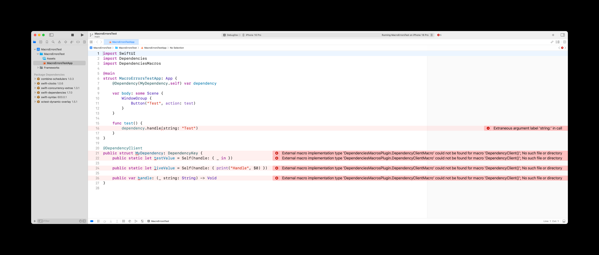

# FB16529336: Xcode falsely showing errors for macros in projects using custom configurations

When using macros in an Xcode project configured with a build configuration other than `Debug` or `Release`, Xcode incorrectly reports errors, even though the build itself completes successfully without issues.

Our project uses configurations such as `DebugDev`, `DebugProd`, and we are seeing two types of errors:

1. Xcode not recognizing macros
    - `External macro implementation type 'X' could not be found for macro 'Y'; No such file or directory`
2. Xcode not recognizing code generated by macros
    - Example from a sample project: `Extraneous argument label 'X' in call`

Despite these errors appearing in the editor and the issue navigator, the project builds correctly, with no related issues in the build log.

Through experimentation, we have determined that Xcode's editor seems to always look for macro binaries in BUILD_ROOT/Debug instead of BUILD_ROOT/CONFIGURATION.
Creating a symlink from BUILD_ROOT/CONFIGURATION to BUILD_ROOT/Debug after a successful build resolves error (1).
Additionally, deleting and recreating Xcode’s index (BUILD_ROOT/../Index.noindex) eliminates error (2).

While this workaround exists, we’d like Xcode to properly support macros in configurations other than `Debug` or `Release` and avoid presenting false errors.

This issue occurs in Xcode 16.2 (16C5032a).
